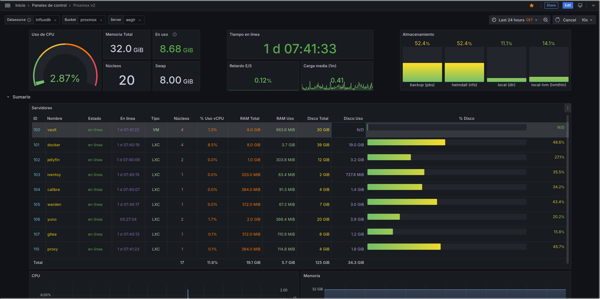

<h1>
  

    
     
    Proxmox Dashboard
  
 
</h1>

<h2> 
  

    Un panel para Proxmox VE basado en el panel de <a href="https://www.smarthomebeginner.com/proxmox-grafana-dashboard/">Anand's de Smart Home Beginner</a>, y retocado por mí. 
	Se basa en InfluxDB y Grafana
  

</h2>

### PRÓXIMAMENTE™
